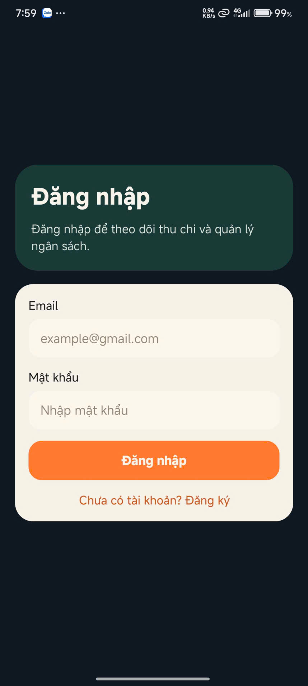
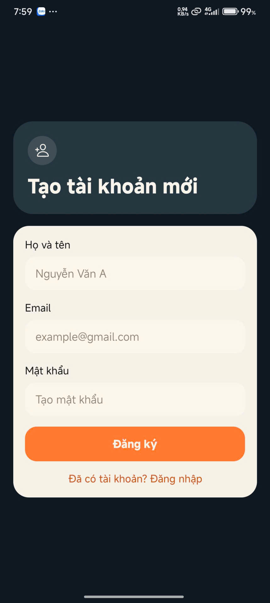
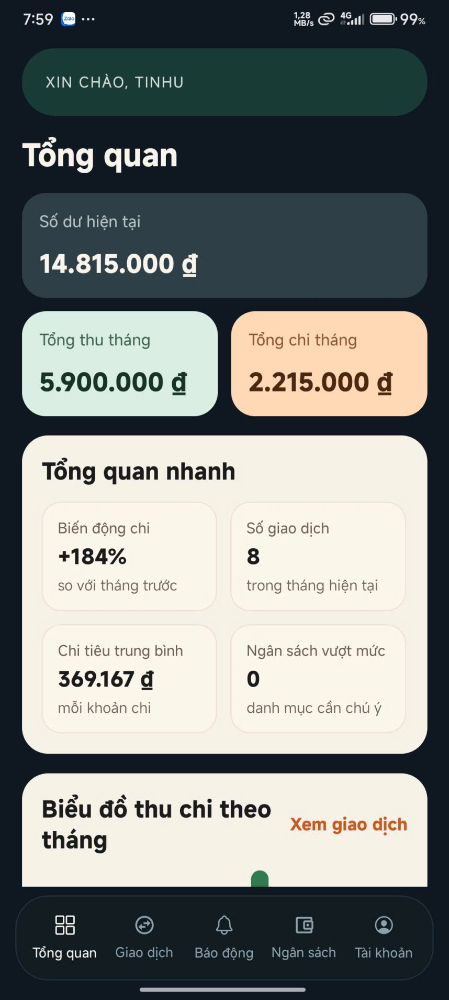
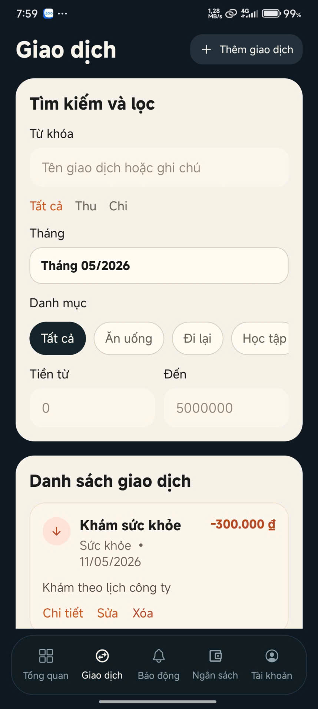
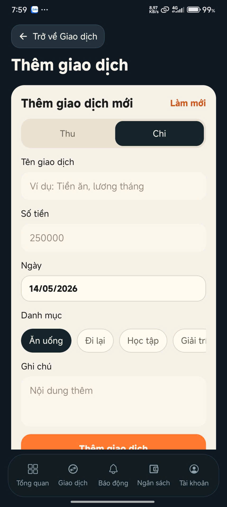
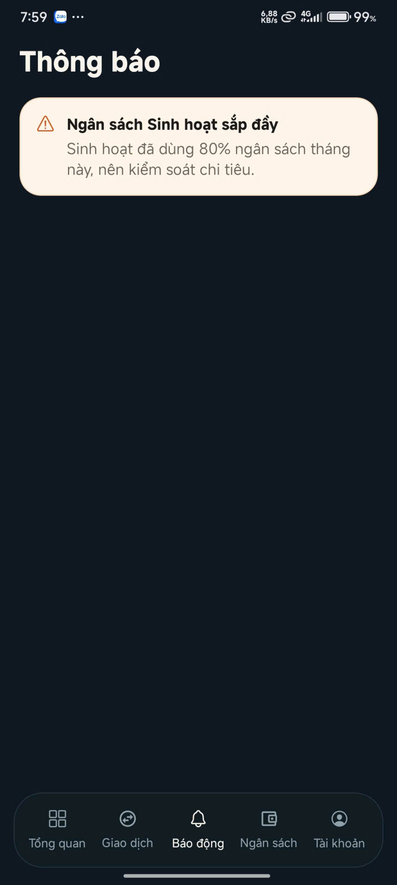
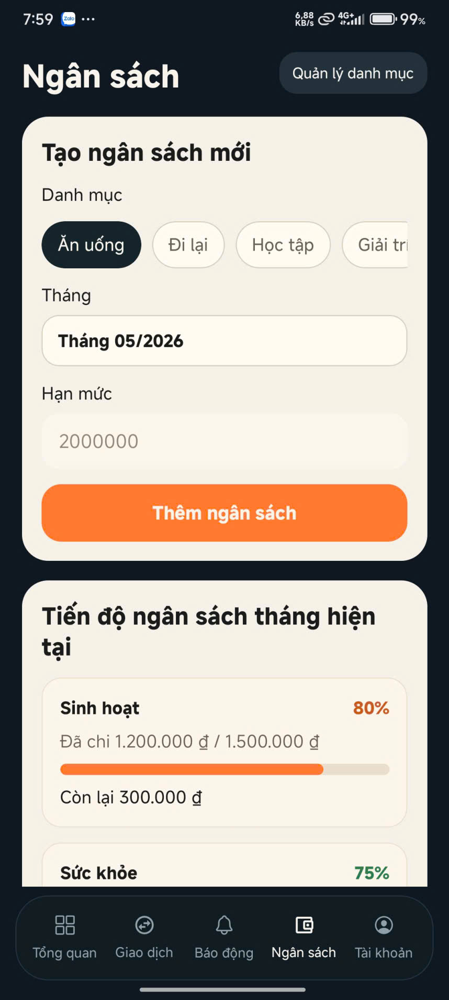
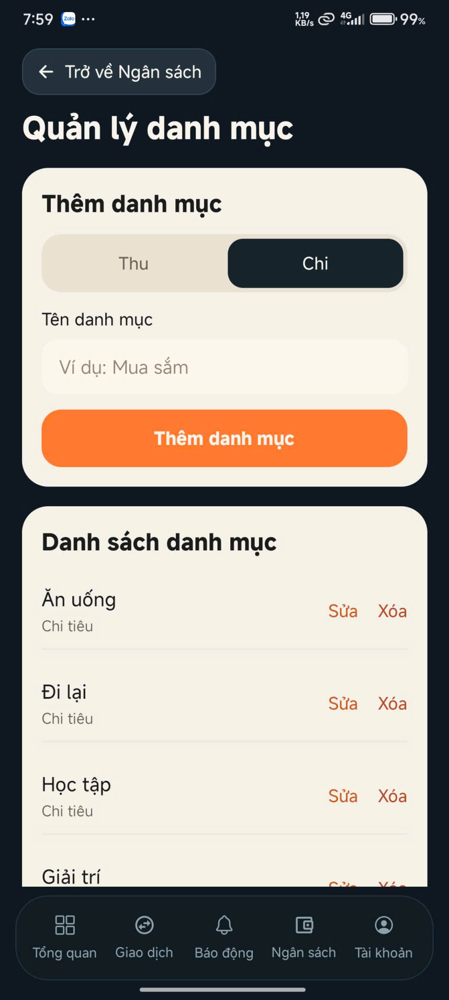
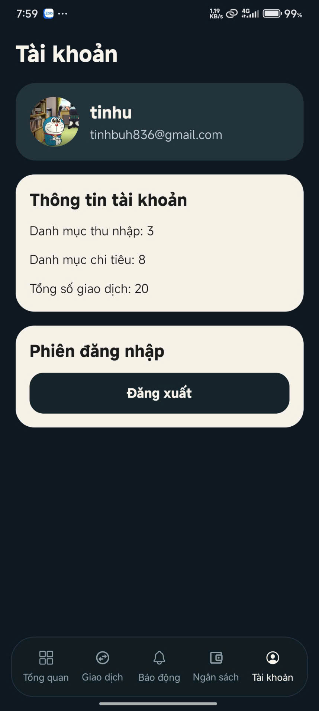

# Đề tài: Xây dựng App Quản lý Chi tiêu Cá nhân

Ứng dụng di động giúp theo dõi thu–chi, phân loại theo danh mục, đặt ngân sách theo tháng, xem thống kê và nhận cảnh báo khi chi tiêu gần hoặc vượt hạn mức.

## Giới thiệu hệ thống

**Quản lý chi tiêu cá nhân** (tên hiển thị trên thiết bị: *Sổ Tay Chi Tiêu*) là ứng dụng React Native/Expo chạy trên Android và iOS. Người dùng đăng ký tài khoản, ghi nhận giao dịch thu/chi, quản lý danh mục, thiết lập ngân sách theo tháng và xem báo cáo trực quan trên màn Tổng quan.

**Đặc điểm chính:**

- Đăng ký, đăng nhập; mỗi tài khoản có dữ liệu riêng.
- CRUD giao dịch; lọc theo từ khóa, loại, tháng, danh mục, khoảng tiền.
- Quản lý danh mục thu/chi; quản lý ngân sách theo danh mục và tháng.
- Thống kê: số dư, tổng thu/chi, biểu đồ cột và biểu đồ tròn.
- Cảnh báo ngân sách từ 80% trở lên (màn **Báo động**).
- Lưu trữ cục bộ bằng **AsyncStorage** (không cần server).

**Kiến trúc tóm tắt:** `App.js` → `AppShell.js` → các `screens` + `components` → hook `useFinanceApp` → AsyncStorage.

---

## Danh sách thành viên

| STT | Họ và tên            | MSSV        | Vai trò |
|-----|----------------------|-------------|---------|
| 1   | Nguyễn Thanh Tịnh    | 23810310439 | Trưởng nhóm |
| 2   | Ngô Xuân Trường      | 23810310345 | Thành viên |
| 3   | Nguyễn Hoàng Việt    | 23810310438 | Thành viên |

---

## Phân công nhiệm vụ

| Thành viên | MSSV | Nhiệm vụ cụ thể |
|------------|------|------------------|
| **Nguyễn Thanh Tịnh** | 23810310439 | Thiết kế layout (`design/figma`); màn Tổng quan, Giao dịch; biểu đồ (`BarChart`, `ExpensePieChart`); component UI dùng chung; tổng hợp README và báo cáo. |
| **Ngô Xuân Trường** | 23810310345 | Hook `useFinanceApp`; tích hợp AsyncStorage; đăng ký/đăng nhập; `utils/selectors.js`, `utils/formatters.js`; xử lý thống kê và cảnh báo ngân sách. |
| **Nguyễn Hoàng Việt** | 23810310438 | Màn Ngân sách, Danh mục, Báo động, Tài khoản, Thêm/sửa giao dịch; form (`DatePickerField`, `MonthYearPickerField`, `PillSelector`); thanh điều hướng `BottomNav`. |

## Công nghệ sử dụng

| Công nghệ / Thư viện | Phiên bản | Mục đích |
|---------------------|-----------|----------|
| React Native | 0.81.5 | Framework UI di động |
| React | 19.1.0 | Thư viện giao diện |
| Expo | ~54.0.31 | Môi trường phát triển & chạy app |
| JavaScript (ES6+) | — | Ngôn ngữ lập trình |
| @react-native-async-storage/async-storage | 2.2.0 | Lưu trữ dữ liệu trên thiết bị |
| react-native-svg | 15.12.1 | Biểu đồ cột, biểu đồ tròn |
| @react-native-community/datetimepicker | 8.4.4 | Chọn ngày giao dịch |
| @react-native-picker/picker | 2.11.1 | Dropdown danh mục, tháng |
| @expo/vector-icons | (kèm Expo) | Icon điều hướng (Ionicons, MaterialCommunityIcons) |

---

## Hướng dẫn cài đặt

### Yêu cầu

- [Node.js](https://nodejs.org/) LTS (khuyến nghị 18.x trở lên)
- [npm](https://www.npmjs.com/) (đi kèm Node.js)
- [Git](https://git-scm.com/)
- Một trong các cách chạy:
  - [Expo Go](https://expo.dev/go) trên điện thoại (Android/iOS), **hoặc**
  - Android Emulator / iOS Simulator

### Các bước

```bash
# 1. Clone repository 
git clone https://github.com/ysisthebest/BaoCaoMobile.git
cd quanlict

# 2. Cài dependency
npm install
```

### Xử lý lỗi thường gặp

| Lỗi | Cách xử lý |
|-----|------------|
| Không quét được QR | Cùng mạng Wi-Fi với máy tính; thử `npx expo start --tunnel` |
| Cache Metro | `npx expo start -c` |
| Lỗi sau khi đổi package | Xóa `node_modules` → `npm install` |

---

## Hướng dẫn chạy project

```bash
# Khởi động Expo Dev Server
npm start
```

Hoặc:

```bash
npx expo start
```

**Chạy trên từng nền tảng:**

```bash
npm run android   # Android emulator / thiết bị
npm run ios       # iOS simulator (macOS)
npm run web       # Trình duyệt (xem nhanh, tùy chọn)
```

**Expo Go:** Sau khi chạy `npm start`, quét mã QR trong terminal bằng app Expo Go.

**Cấu trúc thư mục chính:**

```
quanlict/
├── App.js                 # Entry point
├── app.json               # Cấu hình Expo
├── src/
│   ├── AppShell.js        # Điều hướng tab & màn hình
│   ├── screens/           # Các màn hình
│   ├── components/        # UI tái sử dụng
│   ├── hooks/             # useFinanceApp
│   ├── constants/         # Dữ liệu mẫu, khóa storage
│   └── utils/             # Thống kê, định dạng
├── design/figma/          # Layout SVG tham khảo
└── docs/screenshots/      # Ảnh chụp màn hình demo
```

---

## Tài khoản demo

Ứng dụng **không có sẵn tài khoản cố định trong mã nguồn**. Lần đầu cài, cần **đăng ký** một tài khoản; sau đăng ký hệ thống tự gán **dữ liệu mẫu** (giao dịch, danh mục, ngân sách).

**Tài khoản demo đề xuất** (đăng ký một lần trên máy/Expo Go):

| Trường | Giá trị |
|--------|---------|
| Họ và tên | Nguyen Thanh Tinh |
| Email | `demo.quanlict@epu.edu.vn` |
| Mật khẩu | `123456` |

Sau khi đăng ký, dùng cùng email/mật khẩu để **đăng nhập** ở các lần sau.

> Dữ liệu lưu trong AsyncStorage trên thiết bị. Gỡ app hoặc xóa dữ liệu Expo Go có thể mất tài khoản — khi đó đăng ký lại hoặc dùng email khác.

---

## Hình ảnh minh họa hệ thống

Ảnh chụp màn hình lưu tại thư mục [`design/`](design/).

| STT | Màn hình | File |
|-----|----------|------|
| 1 | Đăng nhập | [`design/dangnhap.jpg`](design/dangnhap.jpg) |
| 2 | Đăng ký | [`design/dangky.jpg`](design/dangky.jpg) |
| 3 | Tổng quan | [`design/tongquan.jpg`](design/tongquan.jpg) |
| 4 | Giao dịch | [`design/giaodich.jpg`](design/giaodich.jpg) |
| 5 | Thêm / sửa giao dịch | [`design/themgiaodich.jpg`](design/themgiaodich.jpg) |
| 6 | Báo động (thông báo ngân sách) | [`design/thongbao.jpg`](design/thongbao.jpg) |
| 7 | Ngân sách | [`design/ngansach.jpg`](design/ngansach.jpg) |
| 8 | Danh mục | [`design/danhmuc.jpg`](design/danhmuc.jpg) |
| 9 | Tài khoản | [`design/taikhoan.jpg`](design/taikhoan.jpg) |

<p align="center">
  
  
  
</p>
<p align="center">
  
  
  
</p>
<p align="center">
  
  
  
</p>


## Link video demo

**Link :** https://drive.google.com/file/d/1s7F7QQZcVwZbN-2ydq_s3-EP-WI46HY5/view?usp=sharing


